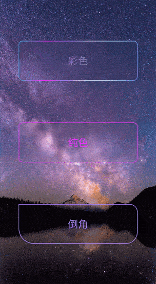

# BlurShape

#### 介绍
Android空间毛玻璃、磨砂、高斯模糊背景，带彩色边框，自定义shape

#### 软件架构
给view添加磨砂背景drawable，自定义的shape

#### 安装教程

自行下载后获取blur_shape module的代码依赖即可，比较简单

#### 使用说明

#### 参与贡献

1.  Fork 本仓库
2.  新建 Feat_xxx 分支
3.  提交代码
4.  新建 Pull Request

